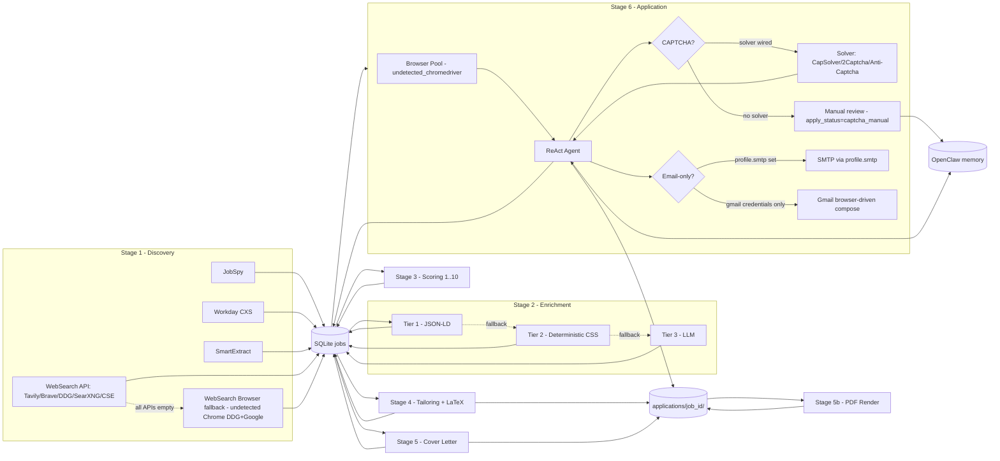

# NexScout Architecture

NexScout is a six-stage pipeline. Each stage writes its results to a single
shared SQLite `jobs` table; the next stage picks up rows whose pending
predicate is true. The pipeline is driven by the standalone
`nexscout autopilot` loop, an OpenClaw heartbeat (`nexscout tick`), a one-shot
`nexscout run`, or — autonomously — by an OpenClaw agent through the
[MCP server layer](#integration-layer-mcp--openclaw).

## Pipeline overview



## Module map

| Package                     | Responsibility                                                |
|-----------------------------|---------------------------------------------------------------|
| `nexscout.core`             | Config, profile loader, SQLite schema, logging, errors        |
| `nexscout.llm`              | Provider router + budget ledger                               |
| `nexscout.discovery`        | JobSpy, Workday, SmartExtract, WebSearch engines              |
| `nexscout.enrichment`       | 3-tier detail cascade (JSON-LD -> CSS -> LLM)                 |
| `nexscout.scoring`          | Scorer, tailor, cover-letter, validator, LaTeX render         |
| `nexscout.browser`          | undetected-chromedriver pool + stealth patches                |
| `nexscout.captcha`          | Detect, CapSolver / 2Captcha / Anti-Captcha providers         |
| `nexscout.apply`            | ReAct agent, orchestrator, tools, dashboard                   |
| `nexscout.agent_backends`   | Pluggable backends (native, claude_code, openai_assistant)    |
| `nexscout.openclaw`         | Skill manifest, memory r/w, `tick` entrypoint, notification channels (Telegram / Discord) |
| `nexscout.mcp`              | FastMCP server exposing 10 agent tools over streamable-http (`server.py`) |
| `nexscout.web`              | FastAPI web UI — Tailwind + Chart.js, non-blocking controls  |
| `nexscout.pipeline`         | Streaming orchestrator                                        |
| `nexscout.wizard`           | Interactive `init` wizard                                     |

## Data flow

1. **Discovery** runs four engines (JobSpy, Workday, SmartExtract, WebSearch).
   Each engine inserts rows into `jobs` with
   `INSERT INTO jobs ... ON CONFLICT(url) DO NOTHING`.
2. **Enrichment** opens each pending row in `undetected_chromedriver`, runs
   three cascading strategies (JSON-LD -> deterministic CSS -> LLM) and saves
   `full_description`, `application_url`, and `cover_required`.
3. **Scoring** sends the description + the candidate's profile-derived
   resume to the LLM with the §10 verbatim prompt and saves a 1..10
   `fit_score` plus comma-separated keywords + reasoning.
4. **Tailoring** asks the LLM for a JSON resume object; the code (never the
   LLM) injects the header from the profile; the validator + an LLM judge
   independently check for fabrication / banned words. Output is written to
   `~/.nexscout/applications/<job_id>/resume.{tex,pdf,txt}`.
5. **Cover letter** runs only if `cover_required = 1` (or
   `apply.always_cover_letter = true`). Same retry / validator pipeline.
6. **Apply** picks the highest-scoring tailored job via an atomic
   `BEGIN IMMEDIATE / UPDATE` acquire, launches a worker browser, then runs a
   ReAct loop driven by the §13.4 system prompt and a tool set
   (`navigate`, `read_page`, `click`, `fill_form`, `upload`,
   `solve_captcha`, ...). Every step is logged to
   `applications/<job_id>/transcript.jsonl`.

## Optional fallback paths

Each external dependency is genuinely optional. The agent never refuses to
start; instead it picks a fallback and proceeds.

| Subsystem    | Primary                              | Fallback                                                          |
|--------------|--------------------------------------|-------------------------------------------------------------------|
| WebSearch    | Tavily / Brave / DDG-HTML / SearXNG / Google CSE | `BrowserSearchProvider` — undetected Chrome scrapes DDG + Google. |
| CAPTCHA      | CapSolver / 2Captcha / Anti-Captcha  | Mark `apply_status='captcha_manual'`; insert a row into `pending_questions`; the active channel (Telegram / Discord) or the OpenClaw inbox surfaces it to the user. |
| Email-only postings | `profile.smtp.*` (host/port/user/password) | `apply.email_browser` drives Gmail's compose URL + login form via undetected Chrome. |
| LLM provider | `profile.llm.primary`                | `profile.llm.fallback` (Ollama by default); budget ledger blocks calls past `monthly_usd` / `daily_calls`. Schemes: `gemini` / `openai` / `anthropic` / `lmstudio` / `ollama` / `openai_compat:<model>` (any OpenAI-compatible endpoint) / `nim:<model>` (NVIDIA NIM). |
| LaTeX engine | Tectonic                             | `latexmk`, then `pdflatex` (twice for refs).                      |

## Apply-outcome taxonomy

The orchestrator classifies every apply attempt into one of four plain-language
buckets (see `apply/result_codes.classify_outcome`). `get_stats` returns
`parked` and `skipped` alongside `applied`; `apply_errors` counts **only**
genuine faults, so the dashboard's "Problems" card stays near zero on a healthy
run.

| Bucket            | UI label         | `apply_status` values                              | Meaning                                          |
|-------------------|------------------|----------------------------------------------------|--------------------------------------------------|
| Applied           | Applied          | `applied`                                          | Submitted successfully.                          |
| Waiting on you    | Waiting on you   | `captcha_manual`, `captcha`, `paused_for_question` | CAPTCHA or a clarifying question needs you. Parked, not an error. |
| Not a match       | Not a match      | `skipped`, `expired`, `login_issue`                | Login / SSO wall, out-of-location, expired. Benign, skipped. |
| Problems (rare)   | Problems         | `failed`                                           | Genuine fault — page crash, infra failure, no result line. The only bucket counted in `apply_errors`. |

## Bundle layout

Each application produces a self-contained directory:

```
~/.nexscout/applications/<job_id>/
├── job.json              snapshot of the DB row at apply-time
├── resume.tex
├── resume.pdf
├── resume.txt
├── cover_letter.{tex,pdf,txt}   only if generated
├── transcript.jsonl      one JSON line per agent step
├── screenshots/
│   ├── 001_landing.png
│   └── ...
├── _REPORT.json          tailor validator/judge report
└── result.json           {status, attempts, duration_ms, cost_usd}
```

## Notification channels

Pending questions and manual-CAPTCHA alerts are pushed to the user through a
delivery channel selected by `profile.openclaw.channel` (or
`settings.yaml -> openclaw.channel` in the split layout):

| `channel` value | Implementation                       | Credentials (env only)                                  |
|-----------------|--------------------------------------|---------------------------------------------------------|
| `cli` (default) | none — OpenClaw inbox only           | —                                                       |
| `telegram`      | `openclaw.telegram.TelegramChannel`  | `TELEGRAM_BOT_TOKEN` + `TELEGRAM_CHAT_ID`               |
| `discord`       | `openclaw.discord.DiscordChannel`    | `DISCORD_WEBHOOK_URL` (preferred) or `DISCORD_BOT_TOKEN` + `DISCORD_CHANNEL_ID` |

`openclaw.channels.get_channel(profile)` resolves the right implementation
from env at runtime. Both channels share the same retry/backoff (3 attempts,
2/4/8s, honouring HTTP 429 `retry_after`) and idempotency
(`pending_questions.channel_delivered_at`) semantics; Telegram formats as
HTML, Discord as markdown.

## Integration layer (MCP + OpenClaw)

NexScout exposes itself to an OpenClaw **agent** as a Model Context Protocol
server so the agent can drive the pipeline autonomously:

- **MCP server** (`nexscout.mcp.server`, FastMCP). Serves the **streamable-http**
  transport on `0.0.0.0:8770` at `/mcp`; shipped as the `nexscout-mcp` console
  script and the `nexscout-mcp` compose service. It exposes ten tools —
  `get_profile`, `get_resume_text`, `pipeline_status`, `discover_jobs`,
  `score_jobs`, `tailor_jobs`, `apply_to_job`, `list_open_questions`,
  `answer_question`, `run_once` — each reading the same `~/.nexscout` state as
  the rest of the stack. The OpenClaw gateway registers it under
  `mcp.servers.nexscout` (`openclaw mcp add nexscout --transport streamable-http
  --url http://nexscout-mcp:8770/mcp`).
- **OpenClaw skill / heartbeat.** The `manifest.toml` skill + slash commands,
  with `nexscout tick` called on the heartbeat.

See `docs/openclaw.md` for the full tool table, registration, and the
heartbeat / memory contract.

## Two dashboards

- **NexScout web UI** (`nexscout web --host 0.0.0.0 --port 8765`) — FastAPI,
  rendered with a modern responsive **Tailwind** layout and interactive
  **Chart.js** graphs. Controls use plain language ("Check for new jobs now",
  "Auto-run") and are non-blocking: long actions return `202 Accepted` and the
  page polls `/controls/status` until the pass completes. The dashboard also
  includes an OpenClaw status panel (last tick, active channel, pending channel
  deliveries).
- **OpenClaw gateway Control UI** (<http://localhost:18789/>) — OpenClaw's own
  native dashboard, served by the `openclaw gateway --port 18789` compose
  service; not a NexScout-built UI. `openclaw dashboard` opens it with an auth
  link.

## Run modes

- **Autopilot (standalone).** Crash-resilient `nexscout autopilot` loop — one
  bounded pass per iteration, persisting to SQLite, wrapped so one error never
  stops the loop. This is the Docker `command`.
- **Hosted-agent (OpenClaw).** Heartbeat calls `nexscout tick`, which does the
  bounded work specified in §18 of the spec and returns. The OpenClaw agent can
  also drive NexScout autonomously through the MCP server above.
- **One-shot.** A single `nexscout run` pass executes the real pipeline once
  and exits. Same code paths underneath.

See `docs/openclaw.md` for the heartbeat / memory contract.
