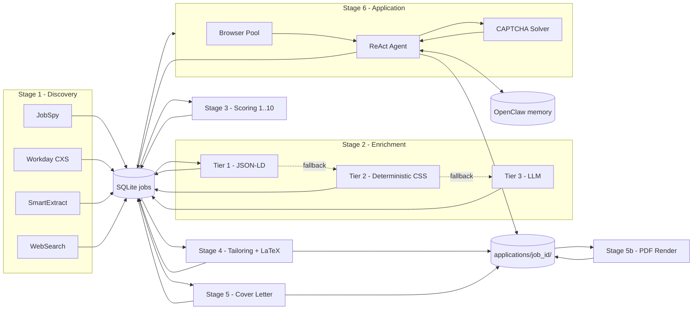

# NexScout Architecture

NexScout is a six-stage pipeline that runs on a heartbeat. Each stage writes
its results to a single shared SQLite `jobs` table; the next stage picks up
rows whose pending predicate is true.

## Pipeline overview



## Module map

| Package                     | Responsibility                                                |
|-----------------------------|---------------------------------------------------------------|
| `nexscout.core`             | Config, profile loader, SQLite schema, logging, errors        |
| `nexscout.llm`              | Provider router + budget ledger                               |
| `nexscout.discovery`        | JobSpy, Workday, SmartExtract, WebSearch engines              |
| `nexscout.enrichment`       | 3-tier detail cascade (JSON-LD -> CSS -> LLM)                 |
| `nexscout.scoring`          | Scorer, tailor, cover-letter, validator, LaTeX render         |
| `nexscout.browser`          | undetected-chromedriver pool + stealth patches                |
| `nexscout.captcha`          | Detect, CapSolver / 2Captcha / Anti-Captcha providers         |
| `nexscout.apply`            | ReAct agent, orchestrator, tools, dashboard                   |
| `nexscout.agent_backends`   | Pluggable backends (native, claude_code, openai_assistant)    |
| `nexscout.openclaw`         | Skill manifest, memory r/w, `tick` entrypoint                 |
| `nexscout.web`              | FastAPI + HTMX UI                                             |
| `nexscout.pipeline`         | Streaming orchestrator                                        |
| `nexscout.wizard`           | Interactive `init` wizard                                     |

## Data flow

1. **Discovery** runs four engines (JobSpy, Workday, SmartExtract, WebSearch).
   Each engine inserts rows into `jobs` with
   `INSERT INTO jobs ... ON CONFLICT(url) DO NOTHING`.
2. **Enrichment** opens each pending row in `undetected_chromedriver`, runs
   three cascading strategies (JSON-LD -> deterministic CSS -> LLM) and saves
   `full_description`, `application_url`, and `cover_required`.
3. **Scoring** sends the description + the candidate's profile-derived
   resume to the LLM with the §10 verbatim prompt and saves a 1..10
   `fit_score` plus comma-separated keywords + reasoning.
4. **Tailoring** asks the LLM for a JSON resume object; the code (never the
   LLM) injects the header from the profile; the validator + an LLM judge
   independently check for fabrication / banned words. Output is written to
   `~/.nexscout/applications/<job_id>/resume.{tex,pdf,txt}`.
5. **Cover letter** runs only if `cover_required = 1` (or
   `apply.always_cover_letter = true`). Same retry / validator pipeline.
6. **Apply** picks the highest-scoring tailored job via an atomic
   `BEGIN IMMEDIATE / UPDATE` acquire, launches a worker browser, then runs a
   ReAct loop driven by the §13.4 system prompt and a tool set
   (`navigate`, `read_page`, `click`, `fill_form`, `upload`,
   `solve_captcha`, ...). Every step is logged to
   `applications/<job_id>/transcript.jsonl`.

## Bundle layout

Each application produces a self-contained directory:

```
~/.nexscout/applications/<job_id>/
├── job.json              snapshot of the DB row at apply-time
├── resume.tex
├── resume.pdf
├── resume.txt
├── cover_letter.{tex,pdf,txt}   only if generated
├── transcript.jsonl      one JSON line per agent step
├── screenshots/
│   ├── 001_landing.png
│   └── ...
├── _REPORT.json          tailor validator/judge report
└── result.json           {status, attempts, duration_ms, cost_usd}
```

## Two run modes

- **Hosted-agent (OpenClaw).** Heartbeat calls `nexscout tick`, which does the
  bounded work specified in §18 of the spec and returns.
- **Standalone.** Plain `nexscout run --continuous` loop. Same code paths
  underneath.

See `docs/openclaw.md` for the heartbeat / memory contract.
